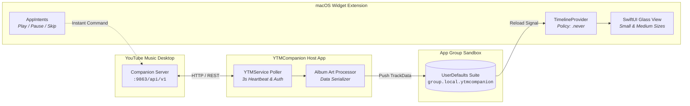

<div align="center">

# 🎵 YTMDesktop macOS Widget

### *Now Playing, right where it belongs — on your desktop.*

A sleek, interactive native macOS desktop widget for **YouTube Music Desktop App (YTMDesktop)**.  
Built with **SwiftUI**, **WidgetKit**, and macOS Sonoma's **AppIntents** for instant, zero-latency playback control.

[](https://swift.org)
[](https://apple.com/macos)
[](https://developer.apple.com/documentation/widgetkit)
[](https://ytmdesktop.app/)
[](LICENSE)

---

</div>

## 💡 The Story

> *"I love YouTube Music, but having to bring the window into focus just to skip a track or see what's playing felt clunky. Apple Music has widgets — why shouldn't YouTube Music?"*

This is my **first native Swift & WidgetKit project**! The goal was to build a desktop widget that feels like a 1st-party Apple experience: glassmorphism, responsive controls, live album art, and seamless background sync.

---

## ✨ Features

- ⏯️ **Interactive Controls on Your Desktop**  
  Play, pause, skip, and rewind directly from your desktop wallpaper or Notification Center without switching windows or launching the main player. Powered by macOS 14's `AppIntents`.

- ⚡ **Optimistic Instant Feedback**  
  No lag or waiting for network roundtrips — the widget updates its play/pause state instantly when clicked, then synchronizes state smoothly with the player.

- 🖼️ **Dynamic Glassmorphic Layouts**  
  Crafted with native SwiftUI materials (`.ultraThinMaterial`), subtle drop shadows, and automatic dark-theme gradients that blend naturally with any desktop background.
  - **Small (`systemSmall`)**: Full-bleed edge-to-edge album artwork with frosted lower pill controls.
  - **Medium (`systemMedium`)**: Two-column layout featuring high-res album cover, track title, artist badge, live status indicators, and frosted button pods.

- 🔒 **Sandboxed Local Bridge**  
  Uses an isolated macOS App Group (`group.local.ytmcompanion`) to bridge live data from the background companion daemon into WidgetKit safely and efficiently.

- 🤝 **One-Click Pairing Handshake**  
  Includes automated 4-digit pairing authentication with YTMDesktop's Companion Server, saving tokens securely to keep background polling active.

---

## 📐 Architecture at a Glance

WidgetKit widgets cannot run background network sockets on their own. **YTMCompanion** acts as the lightweight engine that keeps your widget alive and synced:



---

## 🖥️ Widget Sizes

| Small (`systemSmall`) | Medium (`systemMedium`) |
| :--- | :--- |
| **Album Art Hero** | **Full Track Details & Controls** |
| • Full-bleed cover art background<br>• Frosted glass overlay<br>• Track title & artist<br>• Compact Play/Pause/Skip | • Large high-resolution cover preview<br>• Live `NOW PLAYING` animated badge<br>• High-contrast typography<br>• Dedicated frosted media buttons |

---

## 🚀 Getting Started

### 1. Prerequisites
- **macOS 14.0 Sonoma** or newer.
- [Xcode 15+](https://developer.apple.com/xcode/) installed.
- [YouTube Music Desktop App (YTMDesktop)](https://ytmdesktop.app/) installed and running.

### 2. Enable Companion Server in YTMDesktop
1. Open **YTMDesktop**.
2. Go to **Settings (`Cmd + ,`) > Integrations**.
3. Toggle **Companion Server** to **ON**.
4. Confirm the port is set to `9863` (default).

### 3. Build & Run with Xcode
1. Clone this repository:
   ```bash
   git clone https://github.com/Arbaz2000/YTmusic--widget-for-mac.git
   cd "YTmusic  widget for mac"
   ```
2. Open the project in Xcode:
   ```bash
   open YTMCompanion.xcodeproj
   ```
3. Set your target team in **Signing & Capabilities** for both `YTMCompanion` and `YTMWidgetExtension`.
4. Ensure the App Group `group.local.ytmcompanion` is checked under both targets.
5. Select the **YTMCompanion** scheme and press **`Cmd + R`** to build & run.
6. If prompted, approve the pairing request in YTMDesktop.

### 4. Add the Widget to your Mac Desktop
1. Right-click on your empty desktop and click **Edit Widgets...** (or open Notification Center).
2. Search for **YTMCompanion**.
3. Pick your preferred size (**Small** or **Medium**) and drag it onto your desktop! 🎉

---

## 🧠 What I Learned (First Swift Project)

Building a native macOS desktop widget came with unique challenges:
1. **The Widget Sandbox**: Widgets run in isolated processes and cannot fetch live network streams continuously. Solving this required an App Group shared container architecture.
2. **Interactive Widgets via AppIntents**: Moving beyond static display by leveraging macOS 14's `AppIntent` protocol with optimistic UI updates to make button presses feel instant.
3. **Memory-Conscious Image Pipelines**: Caching album artwork as raw binary data in shared memory rather than refetching image URLs on every polling cycle.
4. **SwiftUI Glassmorphism**: Fine-tuning materials, vibrancy, and contrasting color schemes to ensure text remains readable over bright and dark album covers alike.

---

## 🛠️ Tech Stack

- **Language:** Swift 5.9
- **Frameworks:** SwiftUI, WidgetKit, AppIntents, Combine, AppKit
- **Integration:** YTMDesktop Companion REST API (`v1`)
- **IPC / Data Sharing:** macOS App Groups (`UserDefaults` suite)

---

## 🤝 Contributing

Contributions, feature ideas, and pull requests are welcome!  
If you run into issues or have ideas for large widgets or lyric integration, feel free to open an issue.

---

<div align="center">

Crafted with ❤️ by [arbaz2000](https://github.com/Arbaz2000) • Built with Swift & WidgetKit

</div>
